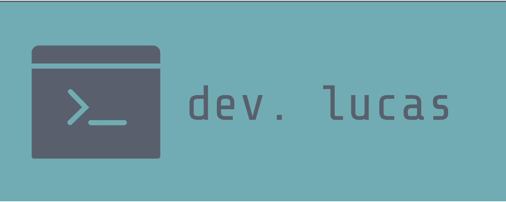

# Bem-vindo a minha página pessoal! 👋

[](https://vuejs.org/)
[](https://opensource.org/licenses/MIT)

Este é o repositório onde compartilho algumas informações sobre mim e projetos que estou trabalhando. Sinta-se à vontade para explorar!

Visite a página:

<a href='https://lugabrielbueno.github.io/homepage/' target='_blank'>

</a>

## Como usar ?

```bash
# Clone este repositório
git clone https://github.com/lugabrielbueno/homepage.git

# Navegue até o diretório
cd homepage

# Instale as dependências
npm install

# Criando servidor local
npm run serve

# Build para produção
npm run build
```

## Licença

Este projeto está licenciado sob a **MIT**, o que significa que você pode usá-lo livremente conforme desejar. Veja o arquivo `LICENSE` para mais detalhes.
