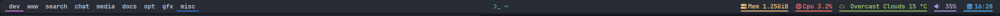
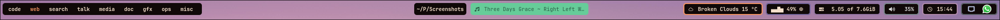

# Hyprland + Waybar + EWW

## Introdução

Há tempos luto contra alguns ambientes em desktop e nunca me dei conta do que realmente me incomodava neles. Em um certo momento (o qual eu claramente
não sei dizer quando), percebi que o que me tirava um pouco do encanto com alguns desktops completos seriam alguns de seus widgets ou aplicativos desnecessários.
Em muitas ocasiões acabo utilizando alguns apps ou widgets de um ambiente desktop, mas a verdade é que a maioria deles acaba sendo inútil, para o meu dia dia é claro, ou simplesmente desnecessário mesmo.
Dessa forma minha única intenção sempre foi manter um ambiente o mais limpo e ao mesmo tempo funcional possível. Rapidamente é de se notar que, caso
queira algo "limpo" um ambiente de desktop completo como GNOME, KDE, XFCE (sendo este o mais leve, mas ainda assim...) não seriam a melhor escolha.
Foi assim que acabei sendo introduzido e por consequência testando vários window managers, eu exploro isso um pouco melhor no meu post sobre window
managers.
Acabei escolhendo o hyprland por sua gigante possibilidade de customização e também por rodar com wayland, que é o servidor gráfico que mais recebe
atualizações recentemente no universo open source.


## Waybar

Eu já testei algumas topbars que existem por ai como xmobar, polybar, i3statusbar, tint2 também já usei como topbar. Por último acabei testando
e gostando da waybar. É verdade que na maioria dos casos eu gosto de testar xmobar com xmonad wm, i3statusbar com i3 wm, hyprland com waybar, etc.
Sinto que a flexibilidade, desempenho e customização melhora um pouco em alguns casos, ou talvez seja só mera impressão.

### Hyprland Desktop

Alguns exemplos de como eu gosto das minhas configurações e outras ideias para as topbars estão adiante.


### Xmobar 


 Este é um exemplo de uma xmobar com algumas configurações simples, seu arquivo de configuração possui a sintaxe descrita abaixo.

> ```sh
>
>
> Config { 
>   -- appearance
>     font =         "xft:Ubuntu:weight=bold:pixelsize=11:antialias=true:hinting=true"
>		 , additionalFonts = [ "xft:Mononoki:pixelsize=11:antialias=true:hinting=true"
>												 , "xft:Font Awesome 6 Free Solid:pixelsize=12"
>												 , "xft:Font Awesome 6 Brands:pixelsize=12"
>												 ]
>	 , bgColor      = "#2E3440"
>	 , fgColor      = "#D8DEE9"
>   , border =       BottomB
>   , borderColor =  "#646464"
>
>   -- layout
>      -- general behavior
>	 , position = TopSize L 100 28
>   , lowerOnStart =     True    -- send to bottom of window stack on start
>   , hideOnStart =      False   -- start with window unmapped (hidden)
>   , allDesktops =      True    -- show on all desktops
>   , overrideRedirect =	True    -- set the Override Redirect flag (Xlib)
>   , pickBroadest =     False   -- choose widest display (multi-monitor)
>   , persistent =       True    -- enable/disable hiding (True = disabled)
>
>   -- plugins
>   --   Numbers can be automatically colored according to their value. xmobar
>   --   decides color based on a three-tier/two-cutoff system, controlled by
>   --   command options:
>   --     --Low sets the low cutoff
>   --     --High sets the high cutoff
>   --
>   --     --low sets the color below --Low cutoff
>   --     --normal sets the color between --Low and --High cutoffs
>   --     --High sets the color above --High cutoff
>   --
>   --   The --template option controls how the plugin is displayed. Text
>   --   color can be set by enclosing in <fc></fc> tags. For more details
>   --   see http://projects.haskell.org/xmobar/#system-monitor-plugins.
>       , commands = [
>                        -- Echos a "penguin" icon in front of the kernel output.
>                      Run Com "echo" ["<fn=3>\xf17c</fn>"] "penguin" 3600
>                    , Run Com "uname" ["-s", "-r"] "kernel" 20
>                        -- Cpu usage in percent
>                    , Run Cpu ["-t", "<fn=2>\xf108</fn>  cpu: (<total>%)","-H","50","--high","red"] 20
>                        -- Ram used number and percent
>                    , Run Memory ["-t", "<fn=2>\xf233</fn>  mem: <used>M (<usedratio>%)"] 20
>                        -- Disk space free
>                    , Run DiskU [("/", "<fn=2>\xf0c7</fn>  hdd: <free> free")] [] 60
>                        -- Echos an "up arrow" icon in front of the uptime output.
>                    , Run Com "echo" ["<fn=2>\xf0aa</fn>"] "uparrow" 3600
>                        -- Uptime
>                    , Run Uptime ["-t", "uptime: <days>d <hours>h"] 360
>                        -- Echos a "bell" icon in front of the pacman updates.
>                    , Run Com "echo" ["<fn=2>\xf0f3</fn>"] "bell" 3600
>                        -- Check for pacman updates (script found in .local/bin)
>                    , Run Com ".config/xmobar/pacupdate.sh" [] "pacupdate" 36000
>                        -- Echos a "battery" icon in front of the pacman updates.
>                    , Run Com "echo" ["<fn=2>\xf242</fn>"] "baticon" 3600
>                        -- Battery
>                    , Run BatteryP ["BAT0"] ["-t", "<acstatus><watts> (<left>%)"] 360
>                        -- Time and date
>                    , Run Date "<fn=2>\xf017</fn>  %b %d %Y - (%H:%M) " "date" 50
>										
>										, Run StdinReader
>                    ]
>	 , sepChar =  "%"   -- delineator between plugin names and straight text
>   , alignSep = "}{"  -- separator between left-right alignment
>	 , template = " %StdinReader%  }{ <box type=Bottom width=2 mb=2 color=#8FBCBB><fc=#8FBCBB>%penguin%  %kernel%</fc></box>    <box type=Bottom width=2 mb=2 color=#A3BE8C><fc=#A3BE8C><action=`alacritty -e htop`>%cpu%</action></fc></box>    <box type=Bottom width=2 mb=2 color=#81A1C1><fc=#81A1C1><action=`alacritty -e htop`>%memory%</action></fc></box>    <box type=Bottom width=2 mb=2 color=#EBCB8B><fc=#EBCB8B>%disku%</fc></box>    <box type=Bottom width=2 mb=2 color=#B48EAD><fc=#B48EAD>%uparrow%  %uptime%</fc></box>    <box type=Bottom width=2 mb=2 color=#88C0D0><fc=#88C0D0>%bell%  <action=`alacritty -e sudo pacman -Syu`>%pacupdate%</action></fc></box>   <box type=Bottom width=2 mb=2 color=#BF616A><fc=#BF616A>%baticon%  %battery%</fc></box>    <box type=Bottom width=2 mb=2 color=#83a598><fc=#83a598>%date%</fc></box>  "
>
>
>   }
>
>```

 
### i3bar+i3status 

 
Este é um exemplo de i3bar + i3status. A sintaxe da i3bar é em conjunto com o arquivo de configuração da própria window manager i3. O nome do arquivo é **config**. É possível configurar a topbar configurando propriamente as linhas abaixo ao arquivo.

> ```
> # Start i3bar to display a workspace bar (plus the system information i3status if available)
> bar {
> 	i3bar_command i3bar
> 	status_command i3status
> 	position bottom
> 
> ## please set your primary output first. Example: 'xrandr --output eDP1 --primary'
> #	tray_output primary
> #	tray_output eDP1
> 
> 	bindsym button4 nop
> 	bindsym button5 nop
> #   font xft:URWGothic-Book 11
> 	strip_workspace_numbers yes
> 
>     colors {
>         background #222D31
>         statusline #F9FAF9
>         separator  #454947
> 
> #                      border  backgr. text
>         focused_workspace  #F9FAF9 #16a085 #292F34
>         active_workspace   #595B5B #353836 #FDF6E3
>         inactive_workspace #595B5B #222D31 #EEE8D5
>         binding_mode       #16a085 #2C2C2C #F9FAF9
>         urgent_workspace   #16a085 #FDF6E3 #E5201D
>     }
> }
> ```
> Créditos: [tobi-wan-kenobi](https://github.com/tobi-wan-kenobi/bumblebee-status)
> 
### Polybar

Este é um exemplo da minha configuração e customização com polybar, e sua sintaxe está abaixo.

> ```
>
> [global/wm]
> ;https://github.com/jaagr/polybar/wiki/Configuration#global-wm-settings
> margin-top = 0
> margin-bottom = 0
> 
> [settings]
> ;https://github.com/jaagr/polybar/wiki/Configuration#application-settings
> screenchange-reload = true
> compositing-background = over
> compositing-foreground = over
> compositing-overline = over
> compositing-underline = over
> compositing-border = over
> 
> ; Define fallback values used by all module formats
> format-foreground = #FF0000
> format-background = #00FF00
> 
> 
> ;Colors
> [colors]
> ; To change color scheme, change the value inside ${color-scheme.colorXX}.
> ; The following color schemes can be used:
> ; 1. DoomOne
> ; 2. Dracula
> ; 3. GruvboxDark
> ; 4. MonokaiPro
> ; 5. Nord
> ; 6. OceanicNext
> ; 7. Palenight
> ; 8. SolarizedDark
> ; 9. SolarizedLight
> ; 10. TomorrowNight
> 
> background = ${DoomOne.background}
> foreground = ${DoomOne.foreground}
> color0     = ${DoomOne.color0}
> color1     = ${DoomOne.color1}
> color2     = ${DoomOne.color2}
> color3     = ${DoomOne.color3}
> color4     = ${DoomOne.color4}
> color5     = ${DoomOne.color5}
> color6     = ${DoomOne.color6}
> color7     = ${DoomOne.color7}
> color8     = ${DoomOne.color8}
> color9     = ${DoomOne.color9}
> color10    = ${DoomOne.color10}
> color11    = ${DoomOne.color11}
> color12    = ${DoomOne.color12}
> color13    = ${DoomOne.color13}
> color14    = ${DoomOne.color14}
> color15    = ${DoomOne.color15}
> alert      = ${DoomOne.color1}
> 
> [DoomOne]
> background = #282c34
> foreground = #bbc2cf
> color0     = #1c1f24
> color1     = #ff6c6b
> color2     = #98be65
> color3     = #da8548
> color4     = #51afef
> color5     = #c678dd
> color6     = #5699af
> color7     = #abb2bf
> color8     = #5b6268
> color9     = #da8548
> color10    = #4db5bd
> color11    = #ecbe7b
> color12    = #3071db
> color13    = #a9a1e1
> color14    = #46d9ff
> color15    = #dfdfdf
> 
> [Dracula]
> background = #282a36
> foreground = #f8f8f2
> color0     = #000000
> color1     = #ff5555
> color2     = #50fa7b
> color3     = #f1fa8c
> color4     = #bd93f9
> color5     = #ff79c6
> color6     = #8be9fd
> color7     = #bfbfbf
> color8     = #4d4d4d
> color9     = #ff6e67
> color10    = #5af78e
> color11    = #f4f99d
> color12    = #caa9fa
> color13    = #ff92d0
> color14    = #9aedfe
> color15    = #e6e6e6
> 
> [GruvboxDark]
> background = #282828
> foreground = #ebdbb2
> color0     = #282828
> color1     = #cc241d
> color2     = #98971a
> color3     = #d79921
> color4     = #458588
> color5     = #b16286
> color6     = #689d6a
> color7     = #a89984
> color8     = #928374
> color9     = #fb4934
> color10    = #b8bb26
> color11    = #fabd2f
> color12    = #83a598
> color13    = #d3869b
> color14    = #8ec07c
> color15    = #ebdbb2
> 
> [MonokaiPro]
> background = #2D2A2E
> foreground = #FCFCFA
> color0     = #403E41
> color1     = #FF6188
> color2     = #A9DC76
> color3     = #FFD866
> color4     = #FC9867
> color5     = #AB9DF2
> color6     = #78DCE8
> color7     = #FCFCFA
> color8     = #727072
> color9     = #FF6188
> color10    = #A9DC76
> color11    = #FFD866
> color12    = #FC9867
> color13    = #AB9DF2
> color14    = #78DCE8
> color15    = #FCFCFA
> 
> [Nord]
> background = #2E3440
> foreground = #D8DEE9
> color0     = #3B4252
> color1     = #BF616A
> color2     = #A3BE8C
> color3     = #EBCB8B
> color4     = #81A1C1
> color5     = #B48EAD
> color6     = #88C0D0
> color7     = #E5E9F0
> color8     = #4C566A
> color9     = #BF616A
> color10    = #A3BE8C
> color11    = #EBCB8B
> color12    = #81A1C1
> color13    = #B48EAD
> color14    = #8FBCBB
> color15    = #ECEFF4
> 
> [OceanicNext]
> background = #1b2b34
> foreground = #d8dee9
> color0     = #29414f
> color1     = #ec5f67
> color2     = #99c794
> color3     = #fac863
> color4     = #6699cc
> color5     = #c594c5
> color6     = #5fb3b3
> color7     = #65737e
> color8     = #405860
> color9     = #ec5f67
> color10    = #99c794
> color11    = #fac863
> color12    = #6699cc
> color13    = #c594c5
> color14    = #5fb3b3
> color15    = #adb5c0
> 
> [Palenight]
> background = #292d3e
> foreground = #d0d0d0
> color0     = #292d3e
> color1     = #f07178
> color2     = #c3e88d
> color3     = #ffcb6b
> color4     = #82aaff
> color5     = #c792ea
> color6     = #89ddff
> color7     = #d0d0d0
> color8     = #434758
> color9     = #ff8b92
> color10    = #ddffa7
> color11    = #ffe585
> color12    = #9cc4ff
> color13    = #e1acff
> color14    = #a3f7ff
> color15    = #ffffff
> 
> [SolarizedDark]
> background = #002b36
> foreground = #839496
> color0     = #073642
> color1     = #dc322f
> color2     = #859900
> color3     = #b58900
> color4     = #268bd2
> color5     = #d33682
> color6     = #2aa198
> color7     = #eee8d5
> color8     = #002b36
> color9     = #cb4b16
> color10    = #586e75
> color11    = #657b83
> color12    = #839496
> color13    = #6c71c4
> color14    = #93a1a1
> color15    = #fdf6e3
> 
> [SolarizedLight]
> background = #fdf6e3
> foreground = #657b83
> color0     = #073642
> color1     = #dc322f
> color2     = #859900
> color3     = #b58900
> color4     = #268bd2
> color5     = #d33682
> color6     = #2aa198
> color7     = #eee8d5
> color8     = #002b36
> color9     = #cb4b16
> color10    = #586e75
> color11    = #657b83
> color12    = #839496
> color13    = #fdf6e3
> color14    = #93a1a1
> color15    = #6c71c4
> 
> [TomorrowNight]
> background = #1d1f21
> foreground = #c5c8c6
> color0     = #1d1f21
> color1     = #cc6666
> color2     = #b5bd68
> color3     = #e6c547
> color4     = #81a2be
> color5     = #b294bb
> color6     = #70c0ba
> color7     = #373b41
> color8     = #666666
> color9     = #ff3334
> color10    = #9ec400
> color11    = #f0c674
> color12    = #81a2be
> color13    = #b77ee0
> color14    = #54ced6
> color15    = #282a2e
> 
> 
> 
> [bar/mainbar-openbox]
> monitor = ${env:MONITOR}
> ;monitor-fallback = HDMI1
> width = 100%
> height = 20
> ;offset-x = 1%
> ;offset-y = 1%
> radius = 5.0
> fixed-center = true
> bottom = false
> 
> background = ${DoomOne.background}
> foreground = ${DoomOne.foreground}
> 
> line-size = 2
> line-color = #f00
> 
> override-redirect = true
> 
> ; Enable support for inter-process messaging
> ; See the Messaging wiki page for more details.
> enable-ipc = true
> enable-click = true
> 
> border-size = 3
> ;border-left-size = 0
> ;border-right-size = 25
> ;border-top-size = 0
> ;border-bottom-size = 25
> border-color = ${DoomOne.background}
> margin = 10
> 
> 
> 
> padding-left = 1
> padding-right = 1
> 
> module-margin-left = 0
> module-margin-right = 0
> 
> font-0 = "JetBrains Mono Nerd Font:style=Bold:size=9;2"
> font-1 = "JetBrains Mono Nerd Font:style=Bold:size=10;3"
> font-2 = "Font Awesome 6 Free:style=Regular:pixelsize=9;1"
> font-3 = "Font Awesome 6 Free:style=Solid:pixelsize=9;1"
> font-4 = "Font Awesome 6 Brands:pixelsize=9;1"
> 
> modules-left = xworkspaces 
> modules-center = xwindow
> modules-right =  memory2 cpu2 weather pulseaudio datetime tray
> 
> 
> 
> [module/cpu2]
> ;https://github.com/jaagr/polybar/wiki/Module:-cpu
> type = custom/script
> exec = "~/.config/eww/scripts/getcpu --percent"
> ; Seconds to sleep between updates
> ; Default: 1
> interval = 2
> format-prefix = " "
> format-suffix = "%"
> format-prefix-foreground = ${colors.color1}
> format-margin = 1
> click-left = "eww open --toggle --anchor "top right" --pos 0x30 storagemon"
> 
> ; Available tags:
> ;   <label> (default)
> ;   <bar-load>
> ;   <ramp-load>
> ;   <ramp-coreload>
> format = <label>
> format-foreground = ${colors.color1}
> format-background = ${colors.background}
> format-underline = ${colors.color1}
> format-padding = 0
> label-font = 1
> 
> 
> ; Available tokens:
> ;   %percentage% (default) - total cpu load
> ;   %percentage-cores% - load percentage for each core
> ;   %percentage-core[1-9]% - load percentage for specific core
> label = Cpu %output%
> 
> [module/datetime]
> type = custom/script
> interval = 5
> click-left = "eww open --toggle calendar_full --pos 0x30 --anchor 'top right'"
> format-margin = 1
> exec = "~/.local/bin/clock"
> 
> ; NOTE: if you want to use syntax tags here you need to use %%{...}
> format-prefix = "  "
> format-prefix-foreground = ${colors.color4}
> format-foreground = ${colors.color4}
> format-background = ${colors.background}
> format-underline = ${colors.color4}
> 
> 
> [module/xworkspaces]
> type = internal/xworkspaces
> 
> pin-workspaces = false
> enable-click = true
> enable-scroll = false
> reverse-scroll = true
> 
> ;extra icons to choose from
> ;http://fontawesome.io/cheatsheet/
> ;       v     
> 
> icon-0 = dev;
> icon-1 = www;
> icon-2 = search;
> icon-3 = chat;
> icon-4 = music;
> icon-5 = docs;
> icon-6 = opt;
> icon-7 = gfx;
> icon-8 = misc;
> #icon-8 = 9;
> #icon-9 = 10;
> #icon-default = " "
> format = <label-state>
> label-monitor = %name%
> 
> label-active = %name%
> label-active-foreground = ${DoomOne.foreground}
> label-active-background = ${DoomOne.background}
> label-active-padding = 1
> label-active-underline = ${DoomOne.color5}
> 
> label-occupied = %name%
> label-occupied-background = ${DoomOne.background}
> label-occupied-padding = 1
> label-occupied-underline = ${DoomOne.color12}
> 
> label-urgent = %name%
> label-urgent-foreground = ${DoomOne.foreground}
> label-urgent-background = ${colors.alert}
> label-urgent-underline = ${colors.alert}
> label-urgent-padding = 1
> 
> label-empty = %name%
> label-empty-foreground = ${DoomOne.foreground}
> label-empty-padding = 1
> 
> format-foreground = ${DoomOne.foreground}
> format-background = ${DoomOne.background}
> 
> 
> [module/kernel]
> type = custom/script
> exec = uname -r
> tail = false
> interval = 1024
> format-prefix = " 🤖 "
> format-prefix-foreground = ${colors.color2}
> format-foreground = ${colors.color2}
> format-background = ${colors.background}
> format-underline = ${colors.color2}
> format-margin = 2
> format-padding = 0
> 
> 
> 
> [module/memory2]
> ;https://github.com/jaagr/polybar/wiki/Module:-memory
> type = custom/script
> ; Available tokens:
> ;   %percentage_used% (default)
> ;   %percentage_free%
> ;   %gb_used%
> ;   %gb_free%
> ;   %gb_total%
> ;   %mb_used%
> ;   %mb_free%
> ;   %mb_total%
> label = %output%
> label-active-font = 2
> exec = "~/.config/eww/scripts/getstorage --used"
> tail = true
> 
> click-left = "eww open --toggle --anchor "top right" --pos 0x30 storagemon"
> format = Mem <label>
> format-prefix = " "
> format-suffix = "GiB"
> format-prefix-foreground = ${colors.color11}
> format-foreground = ${colors.color11}
> format-background = ${colors.background}
> format-underline = ${colors.color11}
> format-margin = 1
> format-padding = 0
> 
> 
> [module/xwindow]
> ;https://github.com/jaagr/polybar/wiki/Module:-xwindow
> type = internal/xwindow
> 
> ; Available tokens:
> ;   %title%
> ; Default: %title%
> label = %title%
> label-maxlen = 40
> 
> format-prefix = "_ "
> format-foreground = ${colors.color10}
> format-background = ${colors.background}
> 
> [module/weather]
> type = custom/script
> exec = "bash ~/.local/bin/getweather &  bash ~/.config/eww/scripts/getforecast"
> tail = false
> interval = 20
> 
> click-left = "eww open --toggle weather --pos 650x30 --anchor 'top center'"
> 
> format-foreground = ${DoomOne.color2}
> format-background = ${DoomOne.background}
> format-underline = ${DoomOne.color2}
> format-margin = 1
> 
> 
> [module/pulseaudio]
> type = internal/pulseaudio
> 
> ; Sink to be used, if it exists (find using `pacmd list-sinks`, name field)
> ; If not, uses default sink
> ; sink = alsa_output.pci-0000_12_00.3.analog-stereo
> 
> ; Use PA_VOLUME_UI_MAX (~153%) if true, or PA_VOLUME_NORM (100%) if false
> ; Default: true
> use-ui-max = false
> 
> ; Interval for volume increase/decrease (in percent points)
> ; Default: 5
> interval = 5
> ; Available tags:
> ;   <label-volume> (default)
> ;   <ramp-volume>
> ;   <bar-volume>
> format-volume = <ramp-volume> <label-volume>
> format-volume-foreground = ${DoomOne.color13}
> format-volume-background = ${DoomOne.background}
> format-volume-underline = ${DoomOne.color13}
> 
> ; Available tags:
> ;   <label-muted> (default)
> ;   <ramp-volume>
> ;   <bar-volume>
> format-muted = <label-muted>
> 
> ; Available tokens:
> ;   %percentage% (default)
> ;   %decibels%
> label-volume = "%percentage%%"
> 
> ; Available tokens:
> ;   %percentage% (default)
> ;   %decibels%
> label-muted =  muted
> label-muted-foreground = #bc7373
> label-muted-background = ${DoomOne.background}
> label-muted-underline = #bc7373
> 
> ; Only applies if <ramp-volume> is used
> ramp-volume-0 = " "
> ramp-volume-1 = " "
> ramp-volume-2 = " "
> 
> format-volume-margin = 1
> format-muted-margin = 1
> ; Right and Middle click
> click-right = pavucontrol
> ; click-middle = 
> [module/tray]
> 
> type = internal/tray
> format-background = ${DoomOne.background}
> format-margin = 10px
> tray-spacing = 10px
> 
> 
> ```

### Waybar


Este é um exemplo de como mantenho hoje as minhas configurações para topbar usando waybar.
Provavelmente o detalhe mais simples e interessante de utilizar waybar, além é claro da configuração, seria a forma de estilizar que é usando apenas
scss como formatação, muito eficiente quando quer mudar algo que se cansou.

>```sh
> {
>     "layer": "top",
>     "position": "top",
>     "height" : 24,
>     "margin": 5,
>     "reload_style_on_change": true,
>     "modules-left": ["hyprland/workspaces"],
>     "modules-center": ["hyprland/window",  "custom/playerctl"],
>     "modules-right": ["custom/weather", "cpu", "memory","wireplumber", "custom/calendar", "tray"],
>     "hyprland/window": {
>       "format": "{title}",
>       "max-length" : 60
>     },
> 	  "hyprland/workspaces": {
>     "format": "{icon} ",
>     "move-to-monitor": true,
>     "format-icons": {
>       "1": "code",
>       "2": "web",
>       "3": "search",
>       "4": "talk",
>       "5": "media",
>       "6": "doc",
>       "7": "gfx",
>       "8": "ops",
>       "9": "misc",
>     },
>     "persistent-workspaces": {
>       "*": [1,2,3,4,5,6,7,8,9],
>     }
>   },
>   "custom/weather": {
>     "format": "{}",
>     "exec": "~/.local/bin/getweather && ~/.config/eww/scripts/getforecast",
>     "on-click": "~/.local/bin/eww open --toggle weather --screen $(hyprctl monitors -j | jq -r '.[] | select(.focused == true) | .name')",
>     "interval": 900,
>     "max-length": 35
>   },
>   "custom/cava": {
>     "format": "{}",
>     "tooltip": true,
>     "escape": true,
>     "return-type": "json",
>     "exec": "~/.config/waybar/modules-scripts/cava.sh",
>     "on-click": "playerctl play-pause",
>     "on-scroll-up": "playerctl previous",
>     "on-scroll-down": "playerctl next",
>     "max-length": 35
>   },
>   "custom/playerctl": {
>       "format": "<span>  {}</span>",
>       "return-type": "json",
>       "max-length": 35,
>       "exec": "playerctl -a metadata --format '{\"text\": \"{{artist}} ~ {{markup_escape(title)}}\", \"tooltip\": \"{{playerName}} : {{markup_escape(title)}}\", \"alt\": \"{{status}}\", \"class\": \"{{status}}\"}' -F",
>       "on-click-middle": "playerctl play-pause",
>       "on-click": "~/.local/bin/eww open --toggle musicplayer --screen $(hyprctl monitors -j | jq -r '.[] | select(.focused == true) | .name')",
>       "on-click-right": "playerctl next",
>       "scroll-step": 5.0,
>       "on-scroll-up": "amixer -D pulse sset Master 5%+",
>       "on-scroll-down": "amixer -D pulse sset Master 5%-",
>       "smooth-scrolling-threshold": 1,
>   },
>   "cpu": {
>     "interval": 2,
>     "format": "{icon0}{icon1}{icon2}{icon3} {usage:>2}% 󰍛 ",
>     "format-icons": ["▁", "▂", "▃", "▄", "▅", "▆", "▇", "█"],
>     "on-click": "~/.local/bin/eww open --toggle storagemon --screen $(hyprctl monitors -j | jq -r '.[] | select(.focused == true) | .name')",
>   },
>   "memory" : {
>     "interval": 2,
>     "format": "   {used} of {total}GiB",
>     "on-click": "~/.local/bin/eww open --toggle storagemon --screen $(hyprctl monitors -j | jq -r '.[] | select(.focused == true) | .name')",
>   },
> 	"battery": {
> 		"format": "{capacity}% {icon}",
> 		"format-icons": ["", "", "", "", ""]
> 	},
>   "wireplumber": {
>     "format": "    {volume}%",
>     "format-muted": " muted",
>     "on-scroll-up": "amixer -D pulse sset Master 5%+",
>     "on-scroll-down": "amixer -D pulse sset Master 5%-",
>     "on-click": "amixer set Master toggle"
>   },
>   "custom/calendar": {
>     "format": "  {}",
>     "interval": 5,
>     "on-click": "~/.local/bin/eww open --toggle calendar_full --screen $(hyprctl monitors -j | jq -r '.[] | select(.focused == true) | .name')",
>     "exec": "~/.local/bin/clock",
>     },
>   "tray": {
>     "icon-size": 20,
>     "spacing": 10
>   }
> }
> ```

## O que é EWW ?

O [EWW (Elkowar’s Wacky Widgets)](https://github.com/elkowar/eww) é um framework de widgets altamente personalizável para ambientes Linux. Ele permite criar interfaces gráficas leves que ficam no desktop, como barras de status, painéis, ou janelas de informações. É feito em rust, o que significa que tudo é criado com baixo uso de recursos e alta personalização. EWW é uma forma bastante flexível de criar widgets e sua sintaxe é yuck, o que aparentemente não foi uma mera coincidência.

Um power menu simplificado feito com EWW.
[PowerMenu](imgs/powermenu.webp)

## Screenshots do Hypereww


